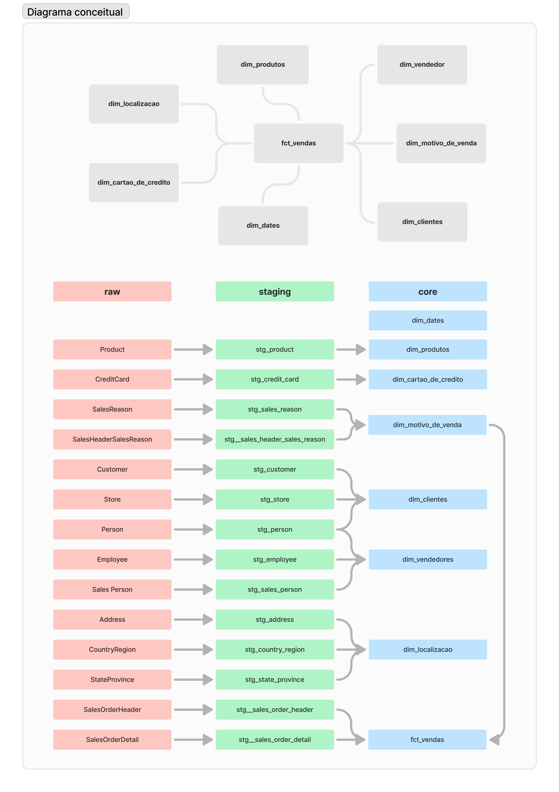

# Projeto de Análise de Dados da Adventure Works

## Estrutura do Projeto
O projeto está dividido nas seguintes etapas principais:
1. **Configuração do data warehouse**
2. **Transformação dos dados**
3. **Modelagem das tabelas de dimensão e fato**
4. **Desenvolvimento de dashboard**

## Ferramentas Utilizadas
- **dbt**: Utilizado para gerenciar o processo de transformação dos dados.
- **Snowflake**: Armazenamento e processamento dos dados.
- **Power BI**: Criação de dashboards interativos para visualização dos dados.

## Processos de Transformação e Tratamento de Dados
1. **Configuração do data warehouse**: O Data Warehouse foi configurado na nuvem utilizando o Snowflake, e o dbt foi integrado para facilitar o gerenciamento do processo de transformação.
2. **Transformação dos dados**: Os dados brutos foram transformados utilizando o dbt, incluindo:
   - Documentação das tabelas e colunas.
   - Testes de sources e chaves primárias.
   - Testes de dados para garantir a integridade e a precisão.
3. **Modelagem das tabelas de dimensão e fato**: Foram criados modelos para tabelas de dimensão (clientes, produtos, datas, localização, motivo de venda, cartão de crédito e vendedores) e tabela de fato (vendas).

## Diagrama conceitual do data warehouse

